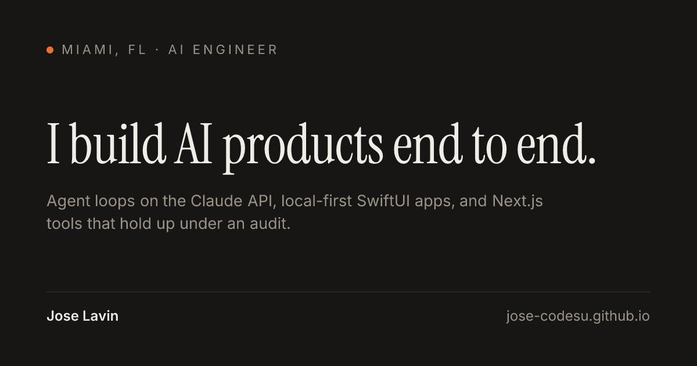

# Jose Lavin — Portfolio

**AI engineer building agent-driven products end to end.**
Live at **[jose-codesu.github.io](https://jose-codesu.github.io)**.

[](https://jose-codesu.github.io)

## What's on the site

- **[Work](https://jose-codesu.github.io/work/)**: case studies for three products built solo.
  - **Savor**: an iOS food journal where an agent on the Claude API turns plain language into structured entries.
  - **Habitat**: a local-first habit tracker for iPhone, Apple Watch and widgets.
  - **Notewell**: session notes for ABA clinics, with AI-drafted narratives and audit checks that run before signing.
- **[Lab](https://jose-codesu.github.io/lab/)**: the work, runnable in the browser. Explore Savor's eval bank or run Notewell's clone detector.
- **[Notes](https://jose-codesu.github.io/notes/)**: technical write-ups on evals, prompt regressions, prompt caching and constrained generation.
- **[Résumé](https://jose-codesu.github.io/resume/)**: built from the same content as the rest of the site, so it cannot drift.

## Built with

Next.js 16 (static export) · React 19 · TypeScript · Tailwind CSS v4 · GitHub Actions · GitHub Pages

## Engineering highlights

- **Content as typed data.** Projects, credentials and notes live in `src/content/` as typed objects, and every page is generated from them. Adding a project touches no components.
- **CI that guards the deploy.** Every push to `main` runs typecheck, lint, build, and a check of the exported site ([`scripts/check-build.mjs`](scripts/check-build.mjs)) that fails on empty pages or missing images before anything goes live.
- **Social cards at build time.** [`scripts/generate-og.mjs`](scripts/generate-og.mjs) renders a card per page with satori and resvg, as real PNG files that GitHub Pages serves with the right content type.
- **Accessible by default.** A native `<dialog>` lightbox, `prefers-reduced-motion` support, descriptive alt text on every screenshot, and a chart palette validated for contrast and color-vision deficiency in light and dark themes.

## Running locally

```bash
npm ci
npm run dev
```

## Rights

© 2026 Jose Lavin. All rights reserved. The source is public so the work can be reviewed. The writing, images, résumé and design are not licensed for reuse.
